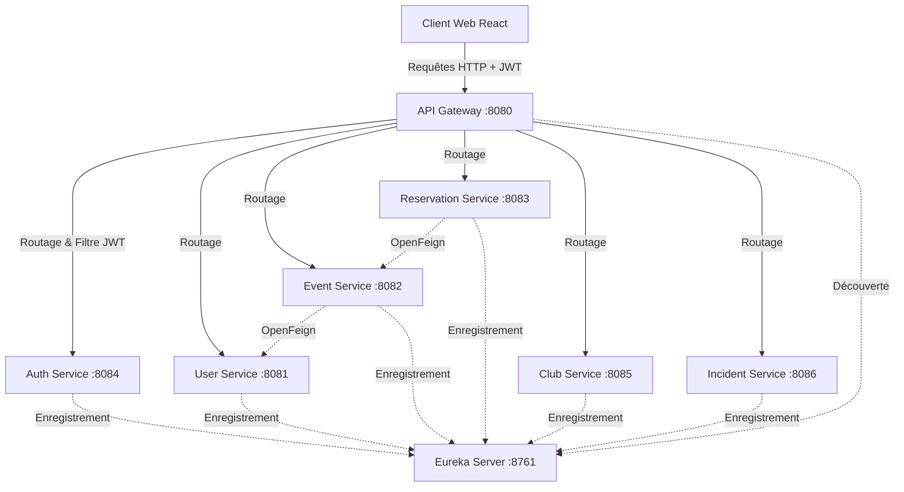

# EspritConnect — Rapport Technique Détaillé

> **Projet** : Plateforme EspritConnect (Microservices + React Frontend)  
> **Module** : Applications Web Distribuées  
> **Établissement** : ESPRIT — École Supérieure Privée d'Ingénierie et de Technologies, Tunisie  
> **Année universitaire** : 2025 – 2026  

---

## Table des matières

1. [Vue d'ensemble et Architecture](#1-vue-densemble-et-architecture)
2. [Infrastructure Principale (Eureka & Gateway)](#2-infrastructure-principale)
3. [Sécurité et Authentification (Auth Service)](#3-sécurité-et-authentification)
4. [Les Microservices Métier](#4-les-microservices-métier)
5. [Communication Inter-Services (OpenFeign)](#5-communication-inter-services)
6. [Interface Utilisateur (Frontend React)](#6-interface-utilisateur)
7. [Tests et Qualité (JUnit & Playwright)](#7-tests-et-qualité)
8. [Guide de Déploiement Local](#8-guide-de-déploiement-local)
9. [Technologies Utilisées](#9-technologies-utilisées)

---

## 1. Vue d'ensemble et Architecture

### 1.1 Contexte du projet
**EspritConnect** est une plateforme complète dédiée aux étudiants, professeurs et administrateurs d'ESPRIT. Elle permet la gestion des profils, la création d'événements, la réservation de salles, l'interaction au sein des clubs et le signalement d'incidents (maintenance, sécurité).

Pour garantir une scalabilité et une robustesse maximales, le système a été conçu de A à Z selon une **architecture microservices**.

### 1.2 Diagramme d'Architecture Complet



---

## 2. Infrastructure Principale

### 2.1 Eureka Server (Service Discovery)
Le cœur de l'orchestration. Tous les microservices (y compris la Gateway) s'enregistrent dynamiquement auprès d'Eureka.
- **Port** : `8761`
- **Avantage** : Évite d'utiliser des adresses IP en dur (`localhost:8081`). La Gateway et Feign utilisent les noms logiques (`USER-SERVICE`, `EVENT-SERVICE`) pour le load balancing et le routage.

### 2.2 API Gateway (Point d'Entrée)
Basée sur **Spring Cloud Gateway**, elle centralise tout le trafic externe.
- **Port** : `8080`
- **Filtres de sécurité** : Un filtre global (`JwtAuthenticationFilter`) intercepte toutes les requêtes (sauf celles destinées à `/auth/**`) pour valider la signature du token JWT.
- **Routage dynamique** : Les requêtes `/api/users/**` sont dirigées vers le `user-service`, `/api/clubs/**` vers `club-service`, etc., en utilisant `lb://` (Load Balancer).

---

## 3. Sécurité et Authentification

L'authentification est gérée de manière distribuée grâce à **JSON Web Tokens (JWT)**.

### 3.1 Auth Service
- **Port** : `8084`
- **Rôle** : S'occupe exclusivement de la connexion (`/auth/login`) et de l'inscription (`/auth/register`).
- **Fonctionnement** :
  1. L'utilisateur envoie son email et son mot de passe.
  2. Le service hache le mot de passe via **BCrypt**.
  3. Si les identifiants sont corrects, un JWT signé est généré et renvoyé.
  4. Ce token contient le rôle de l'utilisateur (`ADMIN`, `STUDENT`) et son ID.

### 3.2 Vérification Décentralisée
Les autres microservices n'ont pas besoin de contacter l'`auth-service` pour vérifier si un utilisateur est authentifié. L'API Gateway s'en charge en vérifiant mathématiquement la validité du token JWT avec la clé secrète partagée.

---

## 4. Les Microservices Métier

Chaque service est complètement autonome, possède sa propre base de données en mémoire (H2) et son propre `DataLoader` (insertion de données par défaut au démarrage).

### 4.1 User Service (`8081`)
- **Rôle** : Gestion des profils utilisateurs étendus.
- **Entités** : `UserProfile` (nom, email, département, année, téléphone).
- **Statistiques** : Endpoint `/api/users/stats` pour le dashboard admin.

### 4.2 Event Service (`8082`)
- **Rôle** : Création et gestion des événements du campus.
- **Entités** : `Event` (capacité, catégorie, statut), `EventRegistration` (pour l'inscription des étudiants).
- **Interaction** : Appelle `user-service` pour enrichir un événement avec les détails de son organisateur.

### 4.3 Reservation Service (`8083`)
- **Rôle** : Réservation de salles pour les réunions ou événements.
- **Entités** : `Room` (capacité, équipement), `Reservation` (en attente, approuvée, rejetée).
- **Logique** : Les administrateurs peuvent approuver ou rejeter les demandes de réservation.

### 4.4 Club Service (`8085`)
- **Rôle** : Gestion de la vie associative.
- **Entités** : `Club` (nom, logo), `ClubMembership` (gestion des rôles dans le club), `ClubPost` (annonces).

### 4.5 Incident Service (`8086`)
- **Rôle** : Signalement des problèmes (Maintenance, Sécurité, Nettoyage).
- **Entités** : `Incident` (titre, lieu, priorité, statut).
- **Workflow** : Un étudiant signale un incident (statut: OPEN). Un admin peut l'assigner (IN_PROGRESS) puis le clôturer (RESOLVED).

---

## 5. Communication Inter-Services

Pour garder le système faiblement couplé, nous utilisons **Spring Cloud OpenFeign**.

### 5.1 Pourquoi OpenFeign ?
Plutôt que d'écrire du code lourd avec `RestTemplate`, Feign permet de créer une simple interface Java.
Exemple dans `event-service` pour récupérer les infos de l'organisateur :
```java
@FeignClient(name = "user-service")
public interface UserClient {
    @GetMapping("/api/users/{id}")
    UserDTO getUserById(@PathVariable("id") Long id);
}
```

### 5.2 Flux d'exécution
Quand l'API Gateway interroge `/api/events/1/with-organizer`, le `event-service` traite la requête, fait un appel interne ultra-rapide vers `user-service` via Feign, fusionne les données, et retourne l'objet JSON complet.

---

## 6. Interface Utilisateur (Frontend)

Le client web a été développé avec **React** et **Vite**, offrant une expérience utilisateur fluide, rapide et moderne (Glassmorphism, Dark Mode).

- **Technologies** : React, Tailwind CSS (Design System), React Router (Navigation), Recharts (Dashboards graphiques), Axios (Requêtes HTTP).
- **Intercepteurs Axios** : Un intercepteur attache automatiquement le header `Authorization: Bearer <token>` à toutes les requêtes sortantes.
- **Dashboards Dynamiques** : L'accueil utilise la bibliothèque `recharts` pour générer des graphiques à partir des endpoints `/stats` fournis par chaque microservice.
- **Rôle-Based UI** : L'interface s'adapte selon que l'utilisateur connecté est un `ADMIN` (accès complet) ou un `STUDENT` (limité).

---

## 7. Tests et Qualité

Pour assurer la stabilité globale de la plateforme, plusieurs couches de tests ont été mises en place :

1. **Tests Backend (JUnit & Spring Boot Test)** :
   - Tests d'intégration sur les microservices (`UserServiceApplicationTests`, `EventServiceApplicationTests`).
   - Validation du démarrage du contexte Spring et des opérations CRUD basiques.
2. **Tests Frontend (Playwright)** :
   - Mise en place de tests **End-to-End (E2E)** automatisés.
   - Scripts simulant le parcours utilisateur réel sur le navigateur (ex: Connexion admin, vérification de l'affichage du Dashboard).

---

## 8. Guide de Déploiement Local

Le projet utilise un script d'orchestration pour lancer tout l'écosystème facilement sous Windows.

### 8.1 Lancement Automatisé
Exécutez le script PowerShell à la racine du projet :
```powershell
.\start-all.ps1
```
Ce script effectue les actions suivantes :
1. Nettoie les anciens processus Java et Node orphelins.
2. Lance `eureka-server` et `api-gateway` dans de nouvelles fenêtres de commande (`cmd.exe /k`).
3. Lance les 5 autres microservices.
4. Démarre le serveur de développement React (`npm run dev`).

### 8.2 Ports Importants
- **8761** : Dashboard Eureka (Statut des services)
- **8080** : API Gateway (Seul port à utiliser pour interroger les API)
- **5173** : Frontend React

---

## 9. Technologies Utilisées

| Technologie | Version | Rôle |
|-------------|---------|------|
| **Java** | 17 | Langage Backend |
| **Spring Boot** | 3.2.5 | Framework Microservices |
| **Netflix Eureka** | 4.1.1 | Service Discovery |
| **Spring Cloud Gateway** | 4.1.2 | Passerelle & Sécurité JWT |
| **OpenFeign** | 4.1.1 | Communication inter-services |
| **H2 Database** | 2.2.x | Bases de données en mémoire |
| **React + Vite** | 18.x | Frontend moderne |
| **Tailwind CSS** | 3.x | Design et UI responsive |
| **Playwright** | 1.4x | Tests End-to-End (E2E) |

---
*Rapport mis à jour le 4 Juillet 2026. L'architecture est désormais finalisée et fonctionnelle.*
